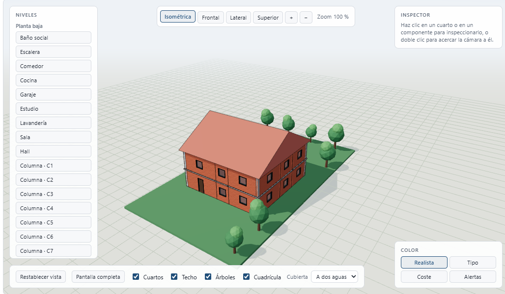
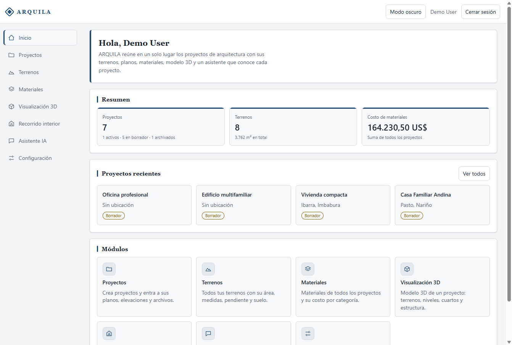
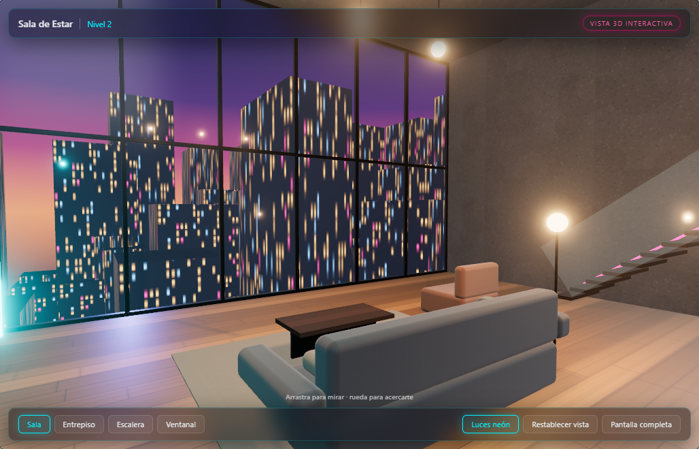
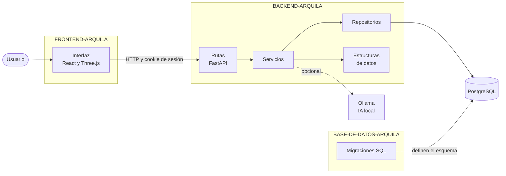

<h1 align="center">ARQUILA</h1>

<p align="center">
  Aplicación web para organizar proyectos de arquitectura:<br>
  terreno, planos, materiales, modelo 3D y un asistente que responde sobre los datos de cada proyecto.
</p>

<p align="center">
  <a href="https://github.com/ssantivr/BACKEND-ARQUILA/actions/workflows/ci.yml"></a>
  <a href="https://github.com/ssantivr/FRONTEND-ARQUILA/actions/workflows/ci.yml"></a>
  <a href="https://github.com/ssantivr/BASE-DE-DATOS-ARQUILA/actions/workflows/ci.yml"></a>
</p>

<p align="center">
  
</p>

<p align="center">
  <b>Aplicación en línea:</b> <a href="https://arquila-frontend.vercel.app">arquila-frontend.vercel.app</a>
</p>

## Contenido

- [Sobre el proyecto](#sobre-el-proyecto)
- [Funcionalidades](#funcionalidades)
- [Arquitectura](#arquitectura)
- [Tecnologías](#tecnologías)
- [Estructuras de datos](#estructuras-de-datos)
- [Inicio rápido](#inicio-rápido)
- [Pruebas y calidad](#pruebas-y-calidad)
- [Seguridad](#seguridad)
- [Organización de este repositorio](#organización-de-este-repositorio)
- [Licencia](#licencia)

## Sobre el proyecto

ARQUILA es un proyecto de cuarto semestre de Ingeniería de Software. Su objetivo es aplicar las estructuras de datos vistas en clase dentro de una aplicación real y bien organizada, en lugar de estudiarlas como ejercicios aislados.

La aplicación reúne en un solo lugar la información de un proyecto de arquitectura: el terreno, los planos y elevaciones, los cuartos, los componentes estructurales y los materiales con su costo. A partir de esos datos dibuja planos de planta y un modelo 3D, genera recomendaciones y permite hacer preguntas a un asistente.

Las seis estructuras estudiadas (array, array dinámico, pila, cola, lista simple y lista doble) están implementadas a mano y cada una resuelve una necesidad concreta de la aplicación.

## Funcionalidades

| Módulo | Qué permite |
|---|---|
| **Proyectos** | Crear, editar y archivar proyectos, o partir de cuatro proyectos de ejemplo ya armados. |
| **Terrenos** | Registrar lotes rectangulares o de forma libre por vértices, con área, pendiente y tipo de suelo. Dibuja vista superior, perfil, curvas de nivel y plano de implantación. |
| **Planos y elevaciones** | Registrar planos por nivel y elevaciones por orientación, con archivos adjuntos (imagen o PDF) que se ven dentro de la aplicación. |
| **Cuartos y estructura** | Definir cuartos, columnas, vigas y muros por plano. Con ellos se generan las plantas acotadas y la ocupación del lote. |
| **Modelo 3D** | Ver el proyecto como un edificio navegable, con vistas de cámara, capas, materiales por elemento y tipo de cubierta. |
| **Recorrido interior** | Recorrer una escena interior de muestra con iluminación y controles de cámara. |
| **Materiales** | Llevar los materiales de cada proyecto con cantidad, costo unitario y costo total. |
| **Análisis** | Generar recomendaciones automáticas por reglas, ordenadas por prioridad. |
| **Asistente** | Conversar sobre los datos del proyecto con un modelo de IA local, o con respuestas por reglas si no hay modelo disponible. |
| **Deshacer y rehacer** | Recuperar elementos eliminados y volver a aplicarlos. |
| **Cuentas** | Registro, inicio de sesión y recuperación de contraseña; cada usuario solo ve sus proyectos. |

<p align="center">
  
  
</p>

## Arquitectura

El proyecto está dividido en tres repositorios de código, uno por capa. Este repositorio los coordina: guarda la documentación general y no contiene código de la aplicación.

| Repositorio | Capa | Contenido |
|---|---|---|
| [FRONTEND-ARQUILA](https://github.com/ssantivr/FRONTEND-ARQUILA) | Interfaz | Pantallas, componentes, escenas 3D y cliente de la API. |
| [BACKEND-ARQUILA](https://github.com/ssantivr/BACKEND-ARQUILA) | API | Rutas, servicios, repositorios, modelos, autenticación y estructuras de datos. |
| [BASE-DE-DATOS-ARQUILA](https://github.com/ssantivr/BASE-DE-DATOS-ARQUILA) | Datos | Esquema en migraciones SQL numeradas, datos de ejemplo y script de creación. |



Cómo se conectan:

- El **frontend** llama a la API por HTTP. La dirección sale de la variable `VITE_API_URL` y la sesión viaja en una cookie `HttpOnly`, así que la interfaz no guarda credenciales.
- El **backend** se conecta a PostgreSQL con `DATABASE_URL` y crea las tablas con las migraciones del repositorio de base de datos, que localiza con `DATABASE_DIR`.
- La **base de datos** no depende de los otros dos: su esquema se puede crear solo con `psql`.

Dentro del backend el código sigue capas: las rutas validan la entrada, los servicios aplican las reglas y los permisos, y los repositorios son los únicos que hablan con la base. El detalle está en [`docs/03_ARQUITECTURA.md`](docs/03_ARQUITECTURA.md).

## Tecnologías

| Capa | Tecnologías |
|---|---|
| Interfaz | TypeScript, React 18, Vite, Three.js |
| API | Python 3.12, FastAPI, SQLAlchemy, Pydantic, Argon2 |
| Datos | PostgreSQL 16 o superior, migraciones en SQL |
| Pruebas | pytest, Vitest, Testing Library |
| Calidad | Ruff, ESLint, Prettier, pre-commit |
| Automatización | Git, GitHub Actions |

## Estructuras de datos

Las estructuras están escritas desde cero en Python, en `BACKEND-ARQUILA/app/data_structures/`, sin `collections.deque` ni otra librería que las reemplace. Cada una se usa en un punto real de la aplicación:

| Estructura | Uso en la aplicación | Dónde está |
|---|---|---|
| Array unidimensional | Cálculo del área de un lote recorriendo sus vértices. | `app/services/geometry.py` |
| Array dinámico | Orden de los materiales por costo para el asistente. | `app/services/material_ranking.py` |
| Pila (LIFO) | «Rehacer» una eliminación deshecha. | `app/services/undo_history.py` |
| Cola (FIFO) | Límite de intentos fallidos de inicio de sesión. | `app/services/login_limiter.py` |
| Lista simplemente enlazada | Ventana con los últimos 20 mensajes enviados a la IA. | `app/services/conversation_context.py` |
| Lista doblemente enlazada | Historial de eliminaciones para «Deshacer». | `app/services/undo_history.py` |

No se implementaron árboles, grafos ni tablas hash porque no forman parte del contenido del curso. La explicación de cada estructura está en [`docs/04_ESTRUCTURAS_DATOS.md`](docs/04_ESTRUCTURAS_DATOS.md) y su complejidad, con tiempos medidos, en [`docs/05_COMPLEJIDAD.md`](docs/05_COMPLEJIDAD.md).

## Inicio rápido

Requisitos: Python 3.12, Node 24 y PostgreSQL 16 o superior.

**1. Clonar los tres repositorios de código en la misma carpeta**

```bash
git clone https://github.com/ssantivr/BASE-DE-DATOS-ARQUILA.git
git clone https://github.com/ssantivr/BACKEND-ARQUILA.git
git clone https://github.com/ssantivr/FRONTEND-ARQUILA.git
```

**2. Crear una base de datos vacía**

```bash
psql -U postgres -c "CREATE DATABASE arquila;"
```

**3. Arrancar el backend**

Copiar `.env.example` a `.env`, poner la contraseña de PostgreSQL en `DATABASE_URL` y ejecutar:

```bash
cd BACKEND-ARQUILA
python -m venv .venv
.venv\Scripts\activate
pip install -r requirements-dev.txt
python -m app.migrate --seed
python -m app.dev
```

`--seed` carga los datos de ejemplo y es opcional. En Linux o macOS el entorno se activa con `source .venv/bin/activate`.

**4. Arrancar el frontend, en otra terminal**

```bash
cd FRONTEND-ARQUILA
npm install
npm run dev
```

| Servicio | Dirección |
|---|---|
| Interfaz | <http://localhost:5173> |
| API | <http://localhost:8000> |
| Documentación interactiva de la API | <http://localhost:8000/docs> |

Con los datos de ejemplo se puede entrar con `demo@example.com` y la contraseña `arquila-demo`. Es una credencial pública, pensada solo para desarrollo.

Las variables de entorno y los comandos de cada parte están en el `README.md` de su repositorio.

La aplicación también está publicada en Vercel, en <https://arquila-frontend.vercel.app>, con los datos de ejemplo cargados: se puede entrar con el usuario de demostración o registrar una cuenta propia. En esa versión el asistente responde con reglas fijas y los archivos subidos no pueden pasar de 4,5 MB.

## Pruebas y calidad

| Repositorio | Comando | Qué comprueba |
|---|---|---|
| `BACKEND-ARQUILA` | `pytest` | 302 pruebas de la API, los servicios y las estructuras de datos. |
| `FRONTEND-ARQUILA` | `npm test` y `npm run build` | 124 pruebas de lógica y componentes, tipos de TypeScript y compilación. |
| `BASE-DE-DATOS-ARQUILA` | `bash scripts/init.sh --seed` | Que el esquema se crea desde cero sobre una base vacía. |

Con los tres repositorios clonados junto a este, un solo comando revisa el formato y las reglas de estilo del backend y del frontend:

```bash
python scripts/quality.py
```

En GitHub, cada repositorio de código ejecuta sus comprobaciones en cada pull request, y la rama `main` solo acepta cambios que las hayan pasado. Al fusionar, la interfaz y la API se publican solas en Vercel y las migraciones nuevas se aplican a la base de datos en línea. Lo que cubren las pruebas y lo que no está en [`docs/06_PRUEBAS.md`](docs/06_PRUEBAS.md).

## Seguridad

- Las contraseñas se guardan con Argon2id; nunca en texto plano.
- La sesión viaja en una cookie `HttpOnly` y en la base solo se guarda su hash.
- Cinco intentos fallidos de inicio de sesión en un minuto bloquean temporalmente el acceso.
- La API solo acepta peticiones del origen de la interfaz y añade cabeceras de seguridad a todas las respuestas.
- Las credenciales viven en archivos `.env` que no se suben a ningún repositorio.

Las decisiones y las limitaciones conocidas están en la sección «Seguridad» de `BACKEND-ARQUILA/docs/BACKEND_Y_API.md`.

## Organización de este repositorio

```text
ARQUILA/
├── docs/                Documentación general e imágenes
├── prompts/             Instrucciones dadas al asistente de IA durante el desarrollo
├── .agents/             Reglas de trabajo del asistente
├── .github/             Plantilla de pull request
├── scripts/             Comando de calidad de los tres repositorios
└── CHANGELOG.md         Cambios agrupados por semana
```

Convenciones del proyecto: los identificadores del código están en inglés, los textos de la interfaz y la documentación en español, y el código no lleva comentarios: los nombres deben bastar para entenderlo y el porqué de cada decisión se explica en la documentación.

## Licencia

Proyecto de uso académico. El código y los documentos se publican para su evaluación y como material de estudio; no se concede permiso para uso comercial.
