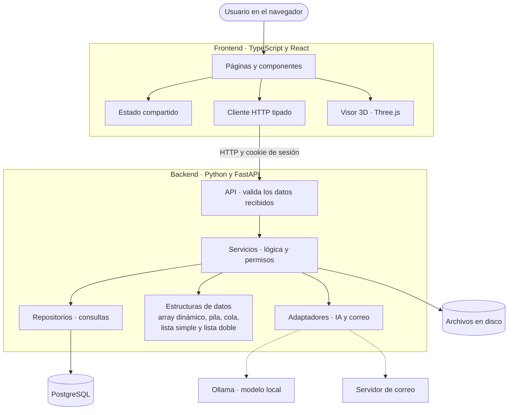

# ARQUITECTURA

El proyecto separa las responsabilidades en partes que se pueden estudiar, probar y cambiar por separado.

```text
Frontend (TypeScript, React)
   |  HTTP
   v
API (FastAPI)                valida los datos recibidos
   |
   v
Servicios                    lógica de negocio y permisos
   |            \
   v             v
Repositorios    Estructuras de datos (Python)
   |
   v
PostgreSQL
```

## Diagrama

El mismo esquema con más detalle. Las flechas continuas son llamadas que ocurren en cada petición; las punteadas, servicios externos que solo se usan si están configurados.



## Frontend

Está en `FRONTEND-ARQUILA/`, escrito en TypeScript con React. Muestra la información y envía peticiones; no guarda datos ni decide permisos.

```text
src/pages/        Pantallas: inicio de sesión, inicio, proyectos y detalle de proyecto
src/components/   Piezas reutilizables: paneles, formularios, esquemas del terreno
src/services/     Cliente HTTP tipado, un método por endpoint
src/types/        Tipos que reflejan los del backend
src/hooks/        Lógica compartida de carga de datos
src/state/        Estado compartido entre el modelo 3D, materiales, recomendaciones y asistente
src/utils/        Cálculo, formato y traducción de mensajes
```

## Backend

Está en `BACKEND-ARGUILA-/`, escrito en Python con FastAPI.

```text
app/api/              Recibe la petición HTTP
app/schemas.py        Forma y validación de los datos
app/services/         Lógica de negocio y control de permisos
app/repositories/     Consultas a la base de datos
app/models.py         Tablas
app/data_structures/  Pila, cola, listas y array dinámico
```

Las decisiones de cada parte están explicadas en `BACKEND-ARGUILA-/docs/BACKEND_Y_API.md`.

## Estructuras de datos

Las estructuras estudiadas están implementadas desde cero en Python, dentro de `BACKEND-ARGUILA-/app/data_structures/`, un archivo por estructura. No importan nada del resto del backend: los servicios las usan, pero ellas no conocen la API ni la base de datos. Por eso se pueden leer, probar y explicar por separado.

Qué servicio usa cada una está en `04_ESTRUCTURAS_DATOS.md`.

## Base de datos

PostgreSQL. El esquema se define con migraciones numeradas en `BASE-DE-DATOS-ARQUILA/migrations/` (ver `BASE-DE-DATOS-ARQUILA/docs/BASE_DATOS.md`).
