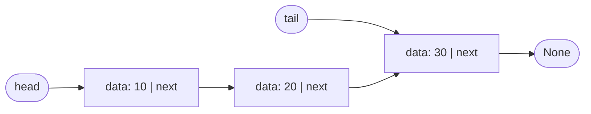
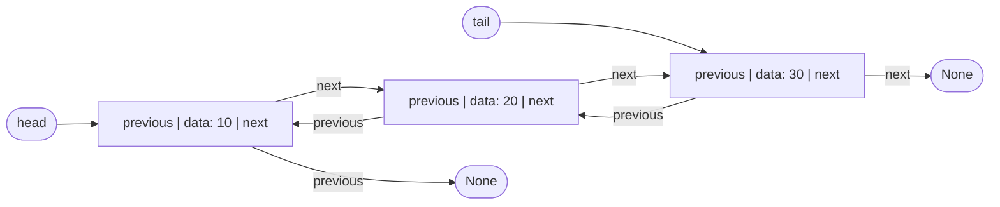

# ESTRUCTURAS DE DATOS

El proyecto usa solo las estructuras trabajadas hasta este punto:

1. Arrays unidimensionales.
2. Arrays dinámicos.
3. Pilas (Stack) con LIFO.
4. Colas (Queue) con FIFO.
5. Listas simplemente enlazadas.
6. Listas doblemente enlazadas.

No se implementaron árboles, grafos ni tablas hash.

Todas están escritas a mano en Python, en `BACKEND-ARQUILA/app/data_structures/`, sin `collections.deque`, `queue` ni otra librería que las reemplace. Sus pruebas están en `BACKEND-ARQUILA/tests/test_data_structures.py`.

## Dónde están y dónde se usan

Las rutas de la segunda columna son relativas a `BACKEND-ARQUILA/app/data_structures/` y las de la tercera a `BACKEND-ARQUILA/app/services/`.

| Estructura | Archivo | Dónde se usa en la app |
|---|---|---|
| Array unidimensional | `arrays.py` (`linear_search`, `binary_search`) | `geometry.py`: `polygon_area` recorre el array de vértices de un lote para calcular su área. |
| Array dinámico | `arrays.py` (`DynamicArray`) | `material_ranking.py`: ordena los materiales del más caro al más barato para el asistente, insertando cada uno en su posición. |
| Stack | `stack.py` | `undo_history.py`: guarda lo que se restauró con «Deshacer» para poder rehacerlo (`POST /projects/{id}/redo`). |
| Queue | `queue.py` | `login_limiter.py`: horas de los intentos fallidos de inicio de sesión de cada correo. |
| Lista simple | `singly_linked_list.py` | `conversation_context.py`: ventana con los últimos 20 mensajes que se envían a la IA. |
| Lista doble | `doubly_linked_list.py` | `undo_history.py`: historial de eliminaciones de cada proyecto. |

La búsqueda lineal y la búsqueda binaria de `arrays.py` son las únicas piezas que la aplicación no usa: solo se ejercitan en las pruebas y en las mediciones.

La complejidad de cada operación y las mediciones de tiempo están en `05_COMPLEJIDAD.md`.

## Array

Un array almacena elementos en posiciones consecutivas y permite acceder a cada uno mediante un índice. El acceso por índice es directo.

- `linear_search` recorre el array de principio a fin y devuelve el índice del valor, o `-1` si no está.
- `binary_search` exige un array ordenado: compara con el elemento del medio y descarta la mitad en cada paso.

## Array dinámico

`DynamicArray` guarda sus elementos en un bloque de tamaño fijo (4 posiciones al crearse) y lleva la cuenta de cuántas están ocupadas.

- Cuando el bloque se llena, `_resize` crea uno del doble de tamaño y copia los elementos uno por uno.
- `insert_at` desplaza una posición a la derecha los elementos que siguen; `remove_at` los desplaza a la izquierda.
- Un índice fuera de rango produce `IndexError`.

## Stack

Una pila utiliza el principio LIFO: Last In, First Out. Está hecha sobre un array de capacidad fija (100 por defecto) y un contador que indica la cima.

- `push` agrega un elemento en la cima. Si la pila está llena, produce `OverflowError`.
- `pop` retira el elemento de la cima. Si está vacía, produce `IndexError`.
- `peek` consulta la cima sin retirarla.
- `is_empty` e `is_full` indican si está vacía o llena.

## Queue

Una cola utiliza el principio FIFO: First In, First Out. Está hecha sobre un array de capacidad fija (100 por defecto), el índice del frente y un contador.

- `enqueue` agrega un elemento al final. Si la cola está llena, produce `OverflowError`.
- `dequeue` retira el elemento del frente. Si está vacía, produce `IndexError`.
- `peek` consulta el frente sin retirarlo.
- `is_empty` e `is_full` indican si está vacía o llena.

La cola es circular: los índices avanzan con el operador módulo y reutilizan las posiciones que quedan libres al retirar elementos.

## Lista simplemente enlazada

Cada nodo contiene un dato (`data`) y una referencia al siguiente nodo (`next`). El último nodo tiene `next` en `None`.

- `head` es la referencia al primer nodo. Todo recorrido empieza ahí y sigue `next` hasta llegar a `None`.
- `tail` es la referencia al último nodo. Existe para que insertar al final sea O(1): sin ella habría que recorrer toda la lista para encontrar el último.
- Solo se puede avanzar. Por eso no hay `pop_back`: para quitar el último habría que recorrer la lista hasta el penúltimo.

Casos borde:

| Caso | Qué ocurre |
|---|---|
| Lista vacía | `head` y `tail` son `None`. `pop_front` produce `IndexError` y `remove` devuelve `False`. |
| Insertar en una lista vacía | El nodo nuevo queda a la vez como `head` y como `tail`. |
| Un solo elemento | `head` y `tail` apuntan al mismo nodo. Al quitarlo, los dos vuelven a `None`. |
| Eliminar la cabeza | `head` pasa al segundo nodo. |
| Eliminar la cola | El `next` del nodo anterior pasa a `None` y `tail` pasa a ese nodo anterior. |
| Eliminar un nodo intermedio | El `next` del nodo anterior salta al nodo siguiente. |
| Invertir | Cada `next` se da la vuelta, y `head` y `tail` se intercambian. |

## Lista doblemente enlazada

Cada nodo contiene un dato, una referencia al nodo anterior (`previous`) y una referencia al siguiente (`next`).

- `head` es el primer nodo y su `previous` es `None`.
- `tail` es el último nodo y su `next` es `None`.
- Como cada nodo conoce a sus dos vecinos, la lista se recorre en los dos sentidos y se puede quitar el último en O(1) con `pop_back`.

Todas las eliminaciones pasan por `_unlink`, que recibe el nodo y ajusta las referencias de sus vecinos:

| Caso | Qué ocurre |
|---|---|
| Lista vacía | `head` y `tail` son `None`. `pop_front` y `pop_back` producen `IndexError` y `remove` devuelve `False`. |
| Insertar en una lista vacía | El nodo nuevo queda a la vez como `head` y como `tail`. |
| Un solo elemento | No hay vecino anterior ni siguiente: al quitarlo, `head` y `tail` vuelven a `None`. |
| Eliminar la cabeza | No hay nodo anterior, así que `head` pasa al siguiente, y el `previous` de ese nodo queda en `None`. |
| Eliminar la cola | No hay nodo siguiente, así que `tail` pasa al anterior, y el `next` de ese nodo queda en `None`. |
| Eliminar un nodo intermedio | El `next` del anterior apunta al siguiente y el `previous` del siguiente apunta al anterior. |

Al insertar en medio hay que cambiar cuatro referencias: las dos del nodo nuevo, el `next` del anterior y el `previous` del siguiente.

## Objetivo académico

El objetivo es comprender cómo funcionan estas estructuras y poder explicar sus operaciones, referencias y costos antes de avanzar a estructuras más complejas.
